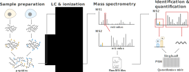

```{r theme, echo=FALSE}
xaringanthemer::style_mono_light(base_color = "#23395b")
```

```{r xaringanExtra, echo=FALSE}
xaringanExtra::use_webcam()     ## use w to turn on webcam
xaringanExtra::use_tile_view()  ## use o to get an overview
xaringanExtra::use_fit_screen() ## use Alt-F to fit to screen
xaringanExtra::use_extra_styles(
  hover_code_line = TRUE
  )
xaringanExtra::use_panelset()
```

```{r libraries, include = FALSE}
```

class: middle
name: cc-by

### Get the slides at https://bit.ly/2021_ib2_scp

These slides are available under a **creative common
[CC-BY license](http://creativecommons.org/licenses/by/4.0/)**. You are
free to share (copy and redistribute the material in any medium or
format) and adapt (remix, transform, and build upon the material) for
any purpose, even commercially
.

---

class: top

# Single-cell technologies

.panelset[

.panel[.panel-name[Concept]

#### Single-cell technologies unravel cellular heterogeneity

.pull-left[

Subpopulation identification

```{r echo=FALSE, out.width='100%', fig.align = 'center'}

```

]
.pull-right[

Differentiation trajectories

```{r echo=FALSE, out.width='100%', fig.align = 'center'}

```

]
]
.panel[.panel-name[Example]

#### scRNA-Seq on murine embryonic liver

.pull-left[

Subpopulation identification

```{r echo=FALSE, out.width='100%', fig.align = 'center'}

```

]
.pull-right[

Differentiation trajectories

```{r echo=FALSE, out.width='100%', fig.align = 'center'}

```

]

Wang et al. 2020. “Comparative Analysis of Cell Lineage Differentiation
during Hepatogenesis in Humans and Mice at the Single-Cell 
Transcriptome Level.” Cell Research 30 (12): 1109–26.

]
]

???

### Concept

Single-cell proteomics is part of the single-cell technologies that are
incredibly powerful when it comes to studying cellular heterogeneity.

The great advantage of single-cell on bulk assays is that they are able
to discover unknown sub-populations, even in well studied tissues. 
Furthermore, single-cell assays capture continuous profiles typical of
differentiation processes. 

Let me show you an example.

### Example

In this study by Wang et al., the authors applied scRNA-Seq on 
embryonic liver. They were able for instance to identify a new 
sub-population of hepatoblasts expressing ID3 that was never described
before. In the same study, they also could reconstruct the hematopoietic
lineage from progenitors that differentiate into neutrophils, 
lymphocytes, dendritic cells,...

But this presentation is about single-cell proteomics, not scRNA-Seq.
So you may ask yourself: why should we bother with proteins?

---

class: top

# RNA vs protein

.panelset[
.panel[.panel-name[Concept]

.left-column[

```{r echo=FALSE, out.width='100%', fig.align = 'center'}

```
]
.right-column[

*RNA &#8776; intention*: RNA is a precursor and "only" provides a proxy
for cell function and identity

*Protein &#8776; function*: proteins bear the cellular function and identity

]
]
.panel[.panel-name[Correlation]

RNA and protein abundances may exhibit poor correlation

```{r echo=FALSE, out.width='60%', fig.align = 'center'}

```

Specht et al. 2021. “Single-Cell Proteomic and Transcriptomic Analysis
of Macrophage Heterogeneity Using SCoPE2.” Genome Biology 22 (1): 50.

]
.panel[.panel-name[Measurement]

.pull-left[

```{r echo=FALSE, out.width='65%', fig.align = 'center'}

```

]
.pull-right[

#### Proteins are more abundant than RNA

Theoretically, counting RNA copies is more subject to stochasticity
than counting protein copies. 

**Challenge**: improve technology to increase sensitivity and accuracy

#### Protein measurements are computed from multiple peptides 

Estimate protein abundance **AND** variance

**Challenge**: improve computational mapping of peptides to proteins

]
]
]

???

### Concept

Well, let us keep this in mind: RNA represent the intention of a cell.
A cell may or may not commit to it. It is a precursor that is "only"
used as a proxy to infer protein abundance. Protein allows for function.
If the cell would want to rub its face, it would probably build a 
protein for it! Hence the protein content will determine the cell's 
identity. 

But can't we simply say that RNA is equal to protein? No we cannot!

### Correlation

...

Ok it is not the same, but at least RNA at single-cell is much easier
to measure. Yes, for the moment, but something important to 
keep in mind is that scRNA-Seq is possible thanks to PCR amplification.

---

class: top

# Single-cell proteomics experimental workflow

```{r echo=FALSE, out.width='100%', fig.align = 'center'}

```

---

class: top

# Single-cell proteomics data analysis

```{r echo=FALSE, out.width='80%', fig.align = 'center'}

```

---

class: top

# Downstream analyses


.panelset[
.panel[.panel-name[Dimension reduction]

```{r echo=FALSE, out.width='30%', fig.align = 'center'}

```

Specht et al. 2021. “Single-Cell Proteomic and Transcriptomic Analysis
of Macrophage Heterogeneity Using SCoPE2.” Genome Biology 22 (1): 50.

]
.panel[.panel-name[Differential abundance]

```{r echo=FALSE, out.width='40%', fig.align = 'center'}

```

Liang et al. 2020. “Fully Automated Sample Processing and 
Analysis Workflow for Low-Input Proteome Profiling.” Analytical 
Chemistry, December. 

]
.panel[.panel-name[Trajectory analysis]

```{r echo=FALSE, out.width='70%', fig.align = 'center'}

```

Schoof et al. 2021. “Quantitative Single-Cell Proteomics as
a Tool to Characterize Cellular Hierarchies.” Nature Communications 12
(1): 745679.

]
]

---
class: top

# Computational challenges

.panelset[
.panel[.panel-name[Batch effect]

```{r echo=FALSE, out.width='65%', fig.align = 'center'}

```


]
.panel[.panel-name[Missingness]
.pull-left[

#### Imputation leads to artefacts

```{r echo=FALSE, out.width='100%', fig.align = 'center'}

```

]
.pull-right[

#### Biological missingness

```{r echo=FALSE, out.width='70%', fig.align = 'center'}
knitr::include_graphics("figs/biological_missingness.svg")
```

]
]
.panel[.panel-name[Batch + Missingness]

```{r echo=FALSE, out.width='100%', fig.align = 'center'}

```
]
]

---

class: top

# In practice

.panelset[
.panel[.panel-name[Software]
.left-column[

```{r echo=FALSE, out.width='40%', fig.align = 'center'}
knitr::include_graphics("figs/R.png")
```


```{r echo=FALSE, out.width='80%', fig.align = 'center'}
knitr::include_graphics("figs/Bioconductor.png")
```

<br>
<br>

```{r echo=FALSE, out.width='40%', fig.align = 'center'}
knitr::include_graphics("figs/Python.png")
```

]
.right-column[

- [`QFeatures`](https://bioconductor.org/packages/release/bioc/html/QFeatures.html) and
  [`scp`](https://bioconductor.org/packages/release/bioc/html/scp.html): 
  manipulate and visualize single-cell proteomics data
- [`scpdata`](https://bioconductor.org/packages/release/data/experiment/html/scpdata.html):
  collection of published data ready to be analyzed
- [SCP.replication](https://uclouvain-cbio.github.io/SCP.replication/index.html):
  website with replication of published analyses

Vanderaa and Gatto. 2021. “Replication of Single-Cell Proteomics Data
Reveals Important Computational Challenges.” Expert Review of 
Proteomics, October, 1–9.

<br>
<br>

- `SCeptre`: a python alternative to `QFeatures` and `scp`

Schoof et al. 2021. “Quantitative Single-Cell Proteomics as a Tool to
Characterize Cellular Hierarchies.” Nature Communications 12 (1):
745679.

]
]
.panel[.panel-name[scp]

```{r, eval = FALSE}
library(scp)
scope2 <- readSCP(featureData = MQdata, colData = annotations, 
                  channelCol = "Channel", batchCol = "Set")
scope2 <- filterFeatures(scope2, ~ Potential.contaminant != "+")
scope2 <- computeSCR(scope2, i = 1:4, colDataCol = "SampleType",
             carrierPattern = "Carrier", samplePattern = "Monocyte")
scope2 <- filterFeatures(scope2, ~ MeanSCR < 0.1)
scope2 <- computeMedianCV(scope2, i = 1:3, proteinCol = "protein", peptideCol = "peptide")
scope2 <- aggregateFeaturesOverAssays(scope2, i = 1:3, name = 4:6, 
                                      fcol = "peptide", fun = robustSummary)
scope2 <- joinAssays(scope2, i = 4:6, name = "peptides")
scope2 <- normalize(scope2, i = "peptides", method = "median", na.rm = TRUE)
scope2 <- logTransform(scope2, i = "normAssay", base = 2)
scope2 <- impute(scope2, i = "normAssay", method = "knn") %>%
scope2 <- aggregateFeatures(i = "logAssay", name = "proteins", fcol = "protein")
```


]
.panel[.panel-name[scpdata]

```{r, message=FALSE}
library(scpdata)
zhu2019EL()
```


]
.panel[.panel-name[SCP.replication]

```{r echo=FALSE, out.width='100%', fig.align = 'center'}

```

]
]

---

class: top

# Take home messages

#### Single-cell proteomics is coming!

#### Exciting challenges: model/correct batch effects and missing data

#### Many opportunities: method development, workflow development, benchmarking, ...


Some usefull refs: 

- Slavov, Nikolai. 2021. “Single-Cell Protein Analysis by Mass 
  Spectrometry.” Current Opinion in Chemical Biology 60 (February): 1–9.
- Kelly, Ryan T. 2020. “Single-Cell Proteomics: Progress and 
  Prospects.” Molecular & Cellular Proteomics: MCP 19 (11): 1739–48.
- Vanderaa et Gatto. 2021. “Replication of Single-Cell Proteomics Data
  Reveals Important Computational Challenges.” Expert Review of 
  Proteomics, October, 1–9.

---

class: top

# Thank you for your attention


**Link to the slides**: https://bit.ly/2021_ib2_scp

<br>

```{r echo=FALSE, out.width='40%', fig.align = 'left'}

```

<br>

```{r echo=FALSE, out.width='100%', fig.align = 'center'}

```
